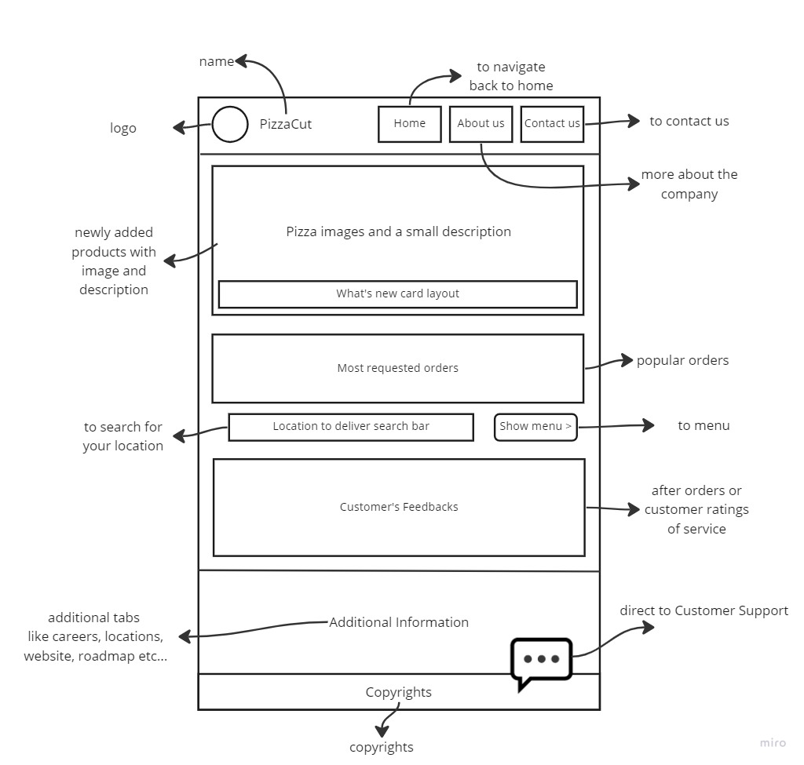

# reading-notes

- In this MD, you might find me explain about the things i learned in the listed courses.
- In this MD you can find, a profile summary of myself.
- In this MD, you can find my ultimate goal.
- In this MD, you will find screenshots of my group's latest website

## Code 102 - Intro to Software Development
## Code 201 - Foundations of Software Development
## Code 301 - Intermediate Software Development
## Code 401 - Advanced Software Development

We learned how to use Ubuntu:
> Ubuntu codes: [Link](https://www.codecademy.com/learn/learn-the-command-line/modules/learn-the-command-line-navigation/cheatsheet).

We learned how to create wireframes like this:

and many more:

|Resourses    | Summary     | Some Notes     |
| :---        |    :----:   |          ---: |
| Header      | Title       | Here's this   |
| Paragraph   | Text        | And more      |

#about SQL:
Relational databases are a type of database that stores and organizes data in tables that are related to one another based on common fields. Each table represents a specific entity or concept, and the relationships between tables are defined by the use of foreign keys.

SQL (Structured Query Language) is a programming language used to manage relational databases. It allows users to create, modify, and query databases, and is used to retrieve data from tables based on specific criteria or conditions.

SQL uses a set of commands or statements to interact with a database, including SELECT, INSERT, UPDATE, DELETE, and JOIN. These statements allow users to create and manipulate data, as well as retrieve and display data in meaningful ways.

Relational databases and SQL are widely used in many industries and applications, from e-commerce websites to financial institutions, due to their ability to efficiently store and retrieve large amounts of data while maintaining data integrity and consistency.

