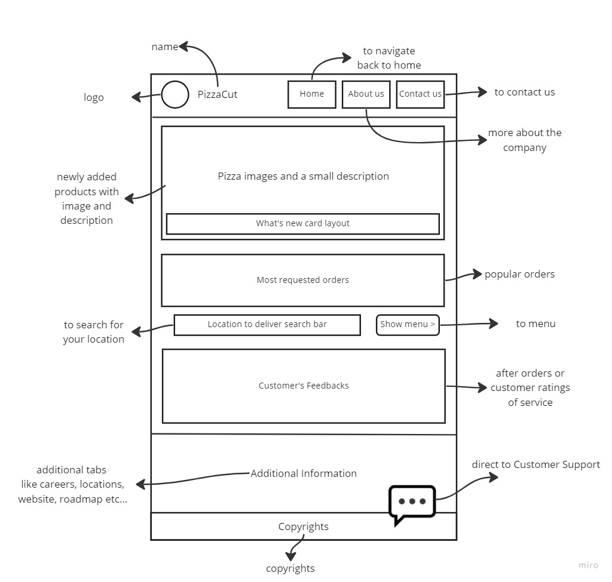

# We learned how to use Ubuntu:
> Ubuntu codes: [Link](https://www.codecademy.com/learn/learn-the-command-line/modules/learn-the-command-line-navigation/cheatsheet).

We learned how to create wireframes like this:

